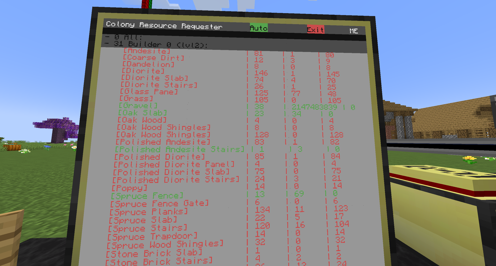

# RCC
>A manager for your Minecolonie

This was a resource requester for the Minecraft mod Minecolonies.
Now its a whole managing programm in the making. You will be able see important stats of your colonie or see current material request that will be automaticly made and send to the colonie.

# Usage

For basic usage, just place an 3x3 Advanced Monitor, an Advanced Computer, a ME or RS Bridge, a storage block like a chest and the Colonie Integrator.

Connect everything with modems and install the programm.

Now you can manage your colonie from one place.

# Installation
Install with `pastebin get CCPD5tYp install` and run `install`

All necessary files will be donwloaded
# ToDo

* WiFi - Add support for the Pocket Computer too see live stats, everywhere
* More Tabs - Add more tabs with all the stats of your colonie
* Fix bugs

## Release History
* 0.2.0
   * Major Improvements to the installer
   * QOL Improvements
   * Bug Fixes 

* 0.1.0
 * Initial Release

# Meta

Christoph Heil – slandalp@gmail.com

Distributed under the MIT license. See [``License``](LICENSE) for more information.

[https://github.com/slanda156/colony-resource-requester](https://github.com/slanda156/colony-resource-requester)

I used this [https://github.com/dbader/readme-template](https://github.com/dbader/readme-template) as a template for the README

## Contributing

Any ideas or bug reports are welcome as issues or comments.

This is a fun project for me. Until most of the program is done, only I will be contributing in pull requests and commits.
